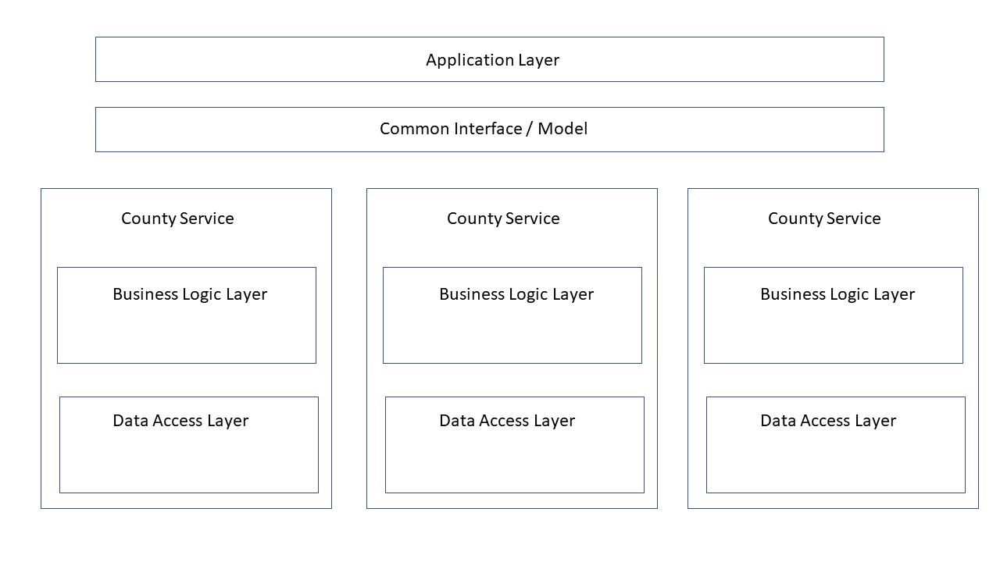

# TODO write script to install each of the packages (pip install -e [FOLDER WITH setup.py])

# County Service Interface
## County Service should return an object with the following:
### get_home_prices(neighborhood, street=None)

# Data Access Layer
## County Services Call Data Access Layer
### Should have interface for getting Tax, Transaction, and Combined Dataframes

